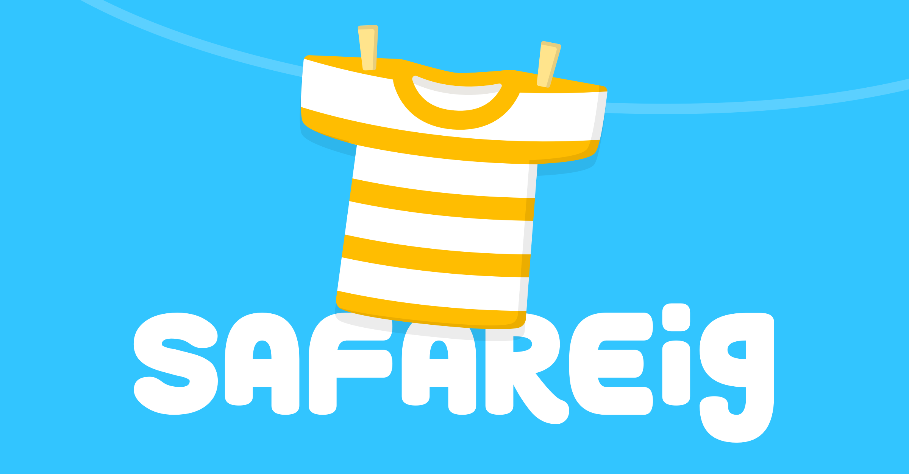

# Safareig

El teu aperitiu setmanal on analitzem com la tecnologia està canviant la societat que ens envolta. Cada dilluns, en 20 minuts, i exclusivament en català.

# Canvis a la pàgina

## Versió 1.2

### Novetats

- Els capítols relacionats es generen ara de manera totalment aleatòria.
- Sóm (una mica més) SEO-friendly: el meta de cada pàgina es popula amb les notes del capítol.

### Millores

- Possibilitat de seguir a Safareig des de la pàgina de capítol.

## Versió 1.1 — 25.01.21

### Novetats

- Navegació per pàgines — cada capítol "viu" a la seva pròpia URL.
- Cada pàgina de capítol té un mòdul de capítols relacionats. Ara per ara, els capítols són estàtics — que els escollim nosaltres, vaja. En un futur els generarem dinàmicament en funció del capítol relacionat.
- També a la pàgina de capítol, ara és possible compartir-lo a Twitter.
- Botó per a escoltar un capítol aleatori a la pàgina d'inici.
- [Pàgina 404](https://www.safareig.fm/upsss) — que esperem mai hagis de visitar, però per si de cas.

### Millores

- Art de la coberta sense la paraula "Safareig" a la pàgina d'inici.
- Noves icones — entre elles la de `Notes del Capítol`, que ara és un subtítol.
- Espaiats entre contenidors, radis de les cartes, i mides de les fonts més consistents.
- Els títols de les cartes sempre es mostren en línia.
